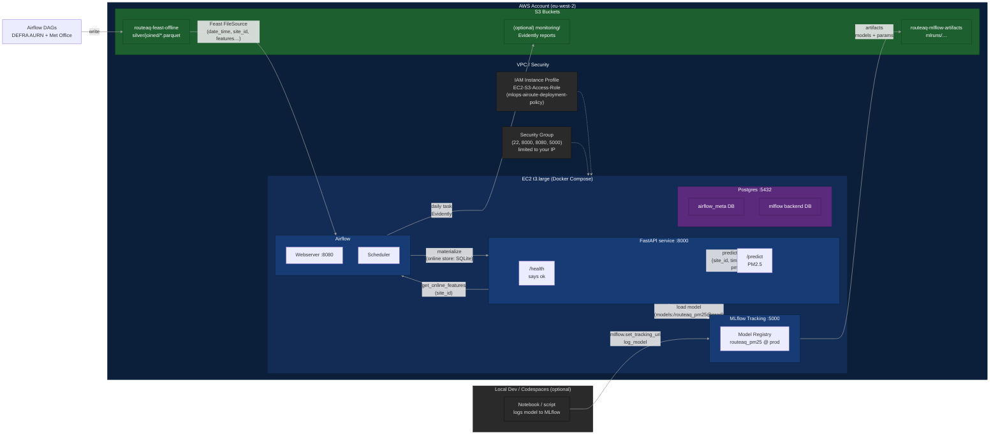

# RouteAQ — cloud-hosted MLOps slice for one-hour-ahead PM₂.₅ forecasts

## Problem we’re solving
Air pollution is a silent but major health risk. People with asthma, parents planning school runs, and city operators need short-term forecasts of pollutant levels they can trust. RouteAQ turns open government data into a cloud-hosted prediction service, starting with fine particulates (PM₂.₅) and extensible to NO₂ and O₃.

Air quality varies block-by-block and hour-by-hour. People with respiratory conditions, cyclists, and city ops teams all need short-horizon forecasts to plan routes and reduce exposure. Public data exists (pollutants from DEFRA AURN and weather from the Met Office), but turning that into a **reliable, cloud-hosted prediction service** is the hard part.

**RouteAQ** is a minimal, production-shaped solution: it ingests open data, builds features, trains a model, registers it in MLflow, and serves real-time predictions on AWS EC2 behind a simple HTTP API. The first target is **PM₂.₅** (fine particulates) one hour ahead. NO₂ and O₃ use the same pattern and are planned next.

---

## What’s working now (MVP)

- ✅ **Serving on EC2** with Docker Compose (`FastAPI` on port **8000**).
- ✅ **Model registry with MLflow** (Postgres backend, **artifacts in S3**).
- ✅ **Features via Feast 0.47** (SQLite online store in-container) **or** robust **S3 Parquet fallback** if Feast isn’t materialized.
- ✅ **PM₂.₅ model** (LightGBM) pulled from MLflow Model Registry at request time.
- ✅ **Prediction logs** written as CSV (quick demo artifact you can plot later).

> This is deliberately a thin, end-to-end vertical slice. It’s enough to review, demo live, and extend. This slice demonstrates PM₂.₅ only. The same pipeline extends easily to NO₂ and O₃; those are planned next steps.

---

## Architecture (accurate to this repo)


---

## How to demo (for reviewers)

On a fresh EC2 (with Docker & Compose installed):

1. `git clone https://github.com/dedenuola/airoute_mlops && cd airoute_mlops`
2. `docker compose up -d postgres mlflow`
3. `docker compose up -d webserver scheduler`
4. `docker compose up -d --build api`
5. Verify:
   - `curl -s http://localhost:8000/health | jq .`
   - `curl -s -X POST http://localhost:8000/predict -H "Content-Type: application/json" -d '{"site_id":"CLL2","timestamp":"2025-08-01T10:00:00Z"}'`
   - `tail -n +1 monitoring/predictions/preds_$(date -u +%F).csv`

Screenshots to capture:  
- `/health` response  
- `/predict` JSON with `pm25_pred`  
- Prediction CSV tail  


## Live demo (EC2)

On the EC2 instance:

```bash
cd ~/airoute_mlops
git pull --rebase

# Start/refresh services
docker compose up -d postgres mlflow
docker compose up -d webserver scheduler
docker compose up -d --build api

# Health
curl -s http://localhost:8000/health | jq .

# Predict (one hour ahead sample)
curl -s -X POST http://localhost:8000/predict   -H "Content-Type: application/json"   -d '{"site_id":"CLL2","timestamp":"2025-08-01T10:00:00Z"}'
# -> {"site_id":"CLL2","timestamp":"2025-08-01T10:00:00Z","pm25_pred":<float>,"source":"feast|parquet"}

# Confirm it logged
tail -n +1 monitoring/predictions/preds_$(date -u +%F).csv
```

---

## Operational sanity checks (quick checklist)

- `GET /health` returns `"status": "ok"` and shows `s3_sample` with at least one match.
- The S3 path in `/health` (`joined_path`) **matches** your bucket/glob:
  `s3://routeaq-feast-offline/silver/joined/*.parquet`.
- MLflow UI reachable on **:5000**  
  - Open SG to your IP **or** tunnel:  
    `ssh -i KEY.pem -N -L 5000:localhost:5000 ec2-user@EC2_PUBLIC_IP` → visit http://localhost:5000
- (Optional) a daily Airflow DAG writes an Evidently report to S3. A placeholder DAG is included; enable it when ready.

---

## Deploying on AWS (minimal)

**Compute:** EC2 t3.large (Amazon Linux or Ubuntu), with Docker & Docker Compose v2.  
**S3 buckets:**
- `routeaq-feast-offline` → `silver/joined/*.parquet`
- `routeaq-mlflow-artifacts` → MLflow artifacts (e.g. `mlruns/<exp>/<run>/...`)

**IAM role** attached to the EC2 instance profile:
- `s3:ListBucket` on both buckets
- `s3:GetObject/PutObject/DeleteObject` on `arn:aws:s3:::routeaq-mlflow-artifacts/*` and `arn:aws:s3:::routeaq-feast-offline/*`
- (Optional) ECR push/pull + CloudWatch Logs basic

**Security group (demo):** inbound 22, 8000, 8080, 5000 from your IP (tighten later).

---

## Local development (optional)

```bash
# Infra
docker compose up -d postgres mlflow
docker compose up -d airflow-init
docker compose up -d webserver scheduler

# API
docker compose up -d --build api

# Test
curl -s http://localhost:8000/health | jq .
```

> If you want Feast online features locally, materialize once:
> `docker compose exec webserver bash -lc 'cd /opt/airflow/feature_repo && feast apply && feast materialize "2025-07-01T00:00:00Z" "$(date -u +%Y-%m-%dT%H:%M:%S)"'`

---

## API

- `GET /health` → shows basic environment + quick S3 check (one matched file if available).
- `POST /predict`
  ```json
  {
    "site_id": "CLL2",
    "timestamp": "2025-08-01T10:00:00Z"
  }
  ```
  Response:
  ```json
  {
    "site_id": "CLL2",
    "timestamp": "2025-08-01T10:00:00Z",
    "pm25_pred": 3.94,
    "source": "feast"  // or "parquet" if Feast fallback was used
  }
  ```

---

## What’s in the repo

```
.
├─ dags/                         # Airflow DAGs (ingestion/monitoring; placeholders included)
├─ feature_repo/                 # Feast repo (aq_feature_view.py, feature_store.yaml)
├─ services/
│  └─ api/
│     ├─ main.py                 # FastAPI app (Feast first, S3 Parquet fallback)
│     ├─ requirements.txt
│     └─ Dockerfile
├─ mlflow.Dockerfile             # MLflow server image
├─ docker-compose.yml            # Postgres, MLflow, Airflow, API
└─ tests/
   └─ smoke_test.sh              # Curl health & predict; exits non-zero if broken
```

**Not checked in** (see `.gitignore`): raw data, large parquet, MLflow artifacts, prediction logs, secrets (`.env`).

---

## Data & privacy

- **DEFRA AURN** is open data; still keep raw drops out of Git.
- **Met Office** datasets have specific license/usage terms. Store credentials in `.env` (gitignored) or in AWS runtime env. Do **not** commit raw downloads. 
⚠️ Raw Met Office downloads are not committed here due to licensing. Only transformed features and models are used.
- Keep S3 buckets private; expose only the API and the needed web UIs via your IP.

---

## Roadmap (after MVP)

- Add **NO₂** and **O₃** models:
  - replicate the PM₂.₅ training/logging flow
  - register `routeaq_no2`, `routeaq_o3` in MLflow
  - Option A: separate endpoints; Option B: `/predict?target=no2|o3|pm25`
- Monitoring:
  - daily Evidently report from the latest `preds_*.csv` (Airflow DAG → HTML/JSON into S3)
  - simple Airflow email/Slack alert if drift detected
- CI/CD:
  - GitHub Action to run `tests/smoke_test.sh` on PRs
  - build & push images (later ECR)

---

## Troubleshooting

- **/predict says “Parquet read failed …”**  
  Check `/health` → `s3_sample` must show at least one file. Verify `ROUTEAQ_JOINED_PATH` in `docker-compose.yml` and that the IAM role includes List/Get on that bucket/prefix.

- **Feast returns Nones**  
  You didn’t materialize (fine — fallback covers you). To use Feast online store, run `feast apply && feast materialize …` inside the Airflow container.

- **MLflow “unhealthy”**  
  Healthcheck hits `/api/2.0/mlflow/experiments/list`. Ensure Postgres is up and `--default-artifact-root` points to your S3 bucket.

---
FAQ

Q: Does this predict into the future (e.g. next year)?
A: No. The model predicts only for timestamps that already have features ingested (weather + lagged pollutants). It is not a forecasting system. When the Airflow DAG is actively running and materializing features, the API will return valid predictions.

Q: Why did my request return an error?
A: Most likely the features for that site_id/timestamp weren’t available. Check that:

/health returns ok

The S3 parquet path or Feast materialization includes your date

Q: What pollutants are supported?
A: This demo serves PM₂.₅. NO₂ and O₃ are planned as immediate next increments.

Q: Is data privacy handled?
A: Yes. Only aggregated, publicly available hourly data (DEFRA/Met Office) are used. No raw or private datasets are committed.

---
## License

MIT
